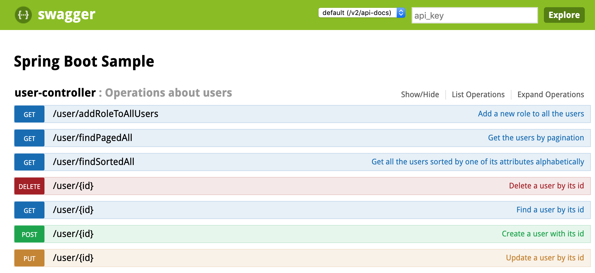
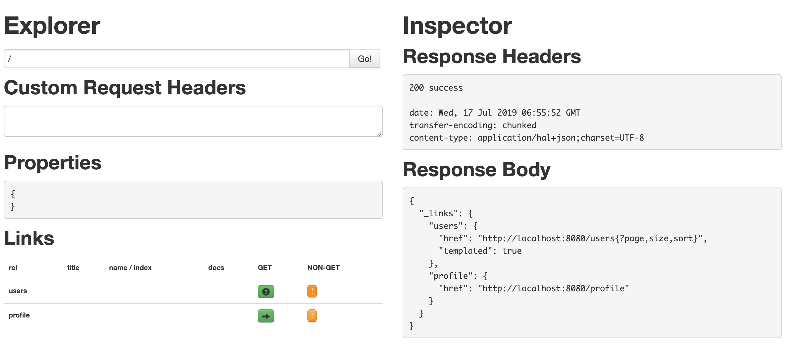
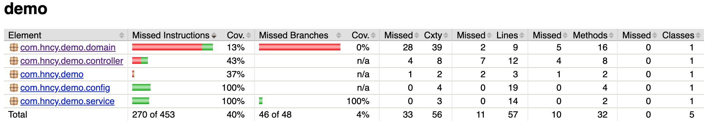
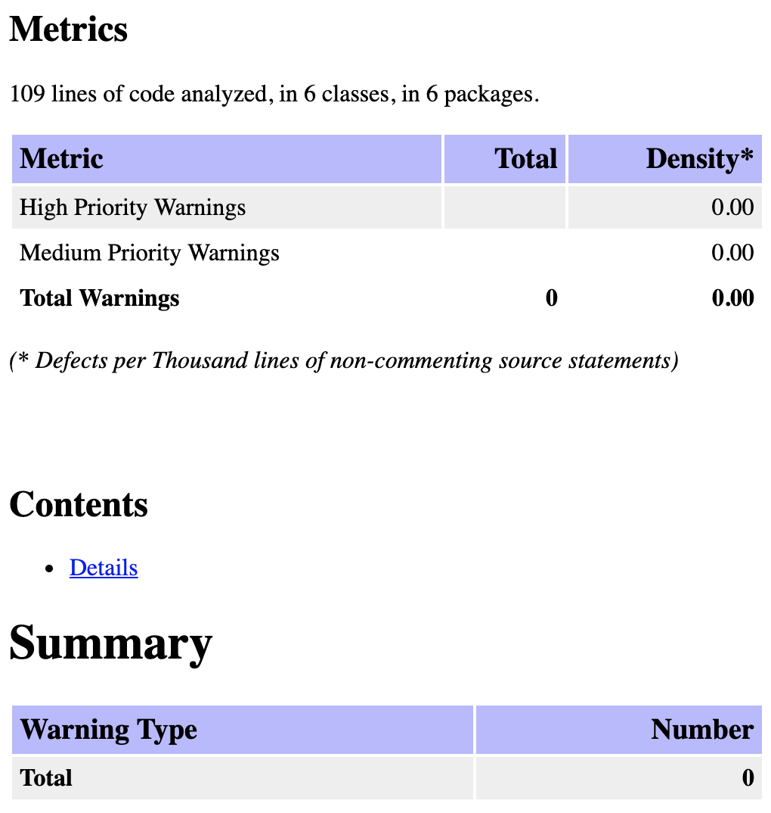

## Spring Boot Sample Code

### Spring Boot 运行
```
mvn clean spring-boot:run
```

当Spring Boot运行后，可以在如下的Swagger UI中查看所有API。

### Swagger UI

Swagger UI的地址在：http://localhost:8080/swagger-ui.html 中查看，如下是截图：


### HAL Browser

HAL Browser的地址在：http://localhost:8080/browser/index.html 中查看，如下是截图：


### Spring Boot 测试

执行测试的命令如下，执行到Maven Lifecycle中的test：
```
mvn clean test
```

在provider微服务中，验证contract的命令如下（其中contract可以来自于本地文件，也可以来自于Pact Broker）：
```
mvn pact:verify
```

在consumer微服务中，上传新生成的contract到Pact Broker服务器的命令如下：
```
mvn pact:publish
```


Sample代码中包括的测试有：
> * MockitoRunner的测试
>     * UserServiceMockTest.java
>
> * SpringRunner的MockBean测试
>     * UserServiceMockSpringContextTest.java

> * Collaborator用真实H2数据库的测试
>     * UserServiceIntegrationTest.java
>     * UserRepositoryIntegrationTest.java
>
> * MockMvc测试
>     * UserControllerIntegrationTest.java
>
> * TestRestTemplate测试
>     * WebIntegrationTest.java
>
> * Pact的Consumer合约生成，目标路径在target/pacts
>     * ConsumerTests.java
>
> * WireMock的第三方API单元测试，Mock其API返回
>     * DownstreamServiceControllerTests.java
>
> * Selenium的UI测试
>     * HTMLPageTest.java

### Jacoco测试报告

Jacoco的单元测试覆盖率在pom.xml中设置，以后会用在持续集成中。

如下设置中，要求的测试覆盖率为0.3，也就是30%：
```
<configuration>
    <rules>
        <rule>
            <element>PACKAGE</element>
			<limits>
				<limit>
				    <counter>LINE</counter>
					<value>COVEREDRATIO</value>
					<minimum>0.3</minimum>
				</limit>
			</limits>
        </rule>
    </rules>
</configuration>
```

Jacoco的报告在target/site/jacoco/index.html，如下是一个截图：


### Findbugs测试报告

Findbugs的报告在target/site/findbugs/findbugsXml.html，如下是一个截图：
<p float="left">
	
</p>

